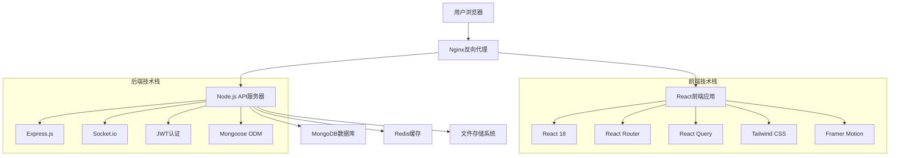

# 🤖 新手开发陪跑器-AI编程学习平台

<div align="center">
  
[](https://nodejs.org/)
[](https://reactjs.org/)
[](https://www.mongodb.com/)
[](LICENSE)
[](CONTRIBUTING.md)

**一个专为新手设计的现代化AI编程学习平台**

提供交互式学习体验、社区交流和实践编程环境  
致力于让AI编程技术更易学习和掌握

[🚀 在线演示](https://demo.codehelperstart-platform.com) | [📖 详细文档](docs/) | [🎯 快速开始](#-快速开始)

</div>


<div align="center">

### 🎓 让每个人都能掌握AI编程技能

</div>

## 📋 目录

- [🌟 功能特性](#-功能特性)
- [🛠️ 技术栈](#️-技术栈)
- [📁 项目结构](#-项目结构)
- [🚀 快速开始](#-快速开始)
- [🔧 开发指南](#-开发指南)
- [📦 Docker部署](#-docker部署)
- [🎯 功能演示](#-功能演示)
- [🧪 测试](#-测试)
- [📊 性能优化](#-性能优化)
- [🔒 安全特性](#-安全特性)
- [🌐 浏览器支持](#-浏览器支持)
- [🤝 贡献指南](#-贡献指南)
- [📋 更新日志](#-更新日志)
- [❓ 常见问题](#-常见问题)
- [🐛 问题反馈](#-问题反馈)
- [📄 许可证](#-许可证)

---

## 🌟 功能特性

<details>
<summary><b>🎯 点击展开查看详细功能清单</b></summary>

### 📖 核心学习功能
- 🤖 **AI辅助编程学习**
  - 集成OpenAI GPT模型提供智能代码解释
  - 支持Python、JavaScript、Java、C++等主流编程语言
  - 机器学习、深度学习专项课程
  - 自然语言处理、计算机视觉实战项目
  - AI算法原理讲解和代码实现

- 📚 **结构化学习路径**
  - 新手入门 → 进阶实践 → 专家级项目的完整学习路径
  - 每个课程包含理论讲解、代码示例、实战练习
  - 支持视频教程、图文教程、交互式练习多种学习方式
  - 个性化学习推荐，根据用户水平调整课程难度
  - 学习进度追踪，支持断点续学

- 💻 **强大的在线代码编辑器**
  - 基于Monaco Editor（VS Code内核）的专业代码编辑环境
  - 支持语法高亮、代码补全、错误提示
  - 实时代码执行，支持Python、Node.js、Java等运行环境
  - 代码分享功能，一键分享代码片段
  - 支持多文件项目编辑，模拟真实开发环境
  - 内置AI代码助手，提供代码优化建议

### 👥 社区交流系统
- 🗣️ **完整论坛功能**
  - 支持发帖、评论、点赞、收藏、分享
  - Markdown富文本编辑，支持代码语法高亮
  - 文件上传功能，支持图片、文档、代码文件
  - 帖子分类管理，支持Python、机器学习、项目展示等分类
  - 标签系统，便于内容筛选和搜索

- 🔍 **智能搜索与推荐**
  - 全文搜索功能，快速找到相关课程和讨论
  - 基于用户行为的个性化内容推荐
  - 热门话题和趋势内容推荐
  - 相关用户推荐，找到学习伙伴

- 🏆 **互动与激励机制**
  - 用户等级系统，通过学习和互动提升等级
  - 徽章成就系统，完成特定任务获得认证
  - 学习排行榜，激发学习积极性
  - 积分系统，参与社区互动获得奖励

### 🔐 用户管理系统
- 👤 **完整的用户体系**
  - 邮箱注册/登录，支持第三方OAuth（GitHub、Google）
  - 个人资料管理，支持头像上传、个人简介等
  - 隐私设置，控制个人信息可见性
  - 账户安全设置，支持密码修改、账户删除

- 📊 **学习数据分析**
  - 详细的学习进度统计和可视化图表
  - 学习时长统计，每日、每周、每月学习报告
  - 知识掌握度评估，识别薄弱环节
  - 学习路径推荐，基于当前水平的下一步学习建议

</details>

### ✨ 平台特色亮点

| 特性 | 描述 | 技术实现 |
|------|------|----------|
| 🎨 **现代化UI/UX** | 采用Material Design设计语言，提供优雅的用户体验 | Tailwind CSS + Framer Motion |
| 📱 **响应式设计** | 完美适配桌面、平板、手机等各种设备 | CSS Grid + Flexbox |
| ⚡ **极速加载** | 优化的前端架构，首屏加载时间 < 2秒 | Code Splitting + Lazy Loading |
| 🔄 **实时同步** | 支持实时通知、在线状态显示、即时聊天 | Socket.io + WebSocket |
| 🌍 **多语言支持** | 支持中文、英文界面切换 | React i18n |
| 🎯 **个性化推荐** | AI驱动的个性化学习内容推荐 | 机器学习推荐算法 |

## 🛠️ 技术栈

<div align="center">

### 🏗️ 架构设计



</div>

### 🖥️ 后端技术栈

| 技术 | 版本 | 用途 | 优势 |
|------|------|------|------|
| **Node.js** | 18.x | JavaScript运行时环境 | 高性能、事件驱动、非阻塞I/O |
| **Express.js** | 4.18+ | Web应用框架 | 轻量级、灵活、中间件丰富 |
| **MongoDB** | 6.0+ | NoSQL数据库 | 文档型存储、高扩展性、JSON友好 |
| **Mongoose** | 7.x | MongoDB对象建模 | 数据验证、查询构建、中间件 |
| **Redis** | 7.x | 内存数据库 | 缓存、会话存储、实时功能 |
| **Socket.io** | 4.x | 实时通信 | WebSocket、实时聊天、通知推送 |
| **JWT** | 9.x | 身份认证 | 无状态、安全、跨域友好 |
| **Multer** | 1.4+ | 文件上传 | 多部分数据处理、文件验证 |
| **Bcryptjs** | 2.4+ | 密码加密 | 单向哈希、盐值处理、安全存储 |
| **Joi** | 17.x | 数据验证 | Schema验证、错误处理、类型检查 |
| **Winston** | 3.x | 日志管理 | 多传输方式、日志级别、格式化 |
| **Nodemailer** | 6.x | 邮件发送 | SMTP支持、模板邮件、附件 |
| **node-cron** | 3.x | 定时任务 | 数据清理、报告生成、备份 |

### 🎨 前端技术栈

| 技术 | 版本 | 用途 | 特点 |
|------|------|------|------|
| **React** | 18.2+ | UI库 | 组件化、虚拟DOM、Hook、并发特性 |
| **React Router** | 6.x | 客户端路由 | 嵌套路由、代码分割、数据加载 |
| **React Query** | 4.x | 服务器状态管理 | 缓存、同步、后台更新、离线支持 |
| **Tailwind CSS** | 3.x | CSS框架 | 原子化类、响应式、可定制 |
| **Framer Motion** | 10.x | 动画库 | 声明式动画、手势处理、布局动画 |
| **Monaco Editor** | 0.4+ | 代码编辑器 | VS Code内核、语法高亮、智能提示 |
| **Lucide React** | 0.2+ | 图标库 | SVG图标、Tree-shaking、可定制 |
| **React Hook Form** | 7.x | 表单管理 | 性能优化、验证、易用性 |
| **React Hot Toast** | 2.x | 通知组件 | 轻量级、可定制、动画效果 |
| **Axios** | 1.x | HTTP客户端 | 请求拦截、响应处理、取消请求 |
| **Date-fns** | 2.x | 日期处理 | 模块化、TypeScript、不可变 |
| **React Helmet** | 6.x | 文档头管理 | SEO优化、动态标题、元标签 |

### 🔧 开发工具链

| 工具 | 用途 | 配置 |
|------|------|------|
| **ESLint** | 代码检查 | Airbnb规范、React Hook规则 |
| **Prettier** | 代码格式化 | 自动格式化、保存时格式化 |
| **Husky** | Git Hook | 提交前检查、推送前测试 |
| **Lint-staged** | 暂存区检查 | 只检查修改的文件 |
| **Jest** | 单元测试 | 测试覆盖率、快照测试 |
| **React Testing Library** | 组件测试 | 用户行为测试、可访问性 |
| **Cypress** | E2E测试 | 端到端测试、可视化调试 |
| **Storybook** | 组件开发 | 隔离开发、文档生成 |

### 🚀 部署与运维

| 技术 | 用途 | 特点 |
|------|------|------|
| **Docker** | 容器化 | 一致性环境、易于部署、扩展性 |
| **Nginx** | 反向代理 | 负载均衡、静态文件服务、SSL |
| **PM2** | 进程管理 | 自动重启、负载均衡、监控 |
| **GitHub Actions** | CI/CD | 自动化测试、构建、部署 |
| **Vercel** | 前端托管 | 全球CDN、无服务器函数、自动部署 |
| **MongoDB Atlas** | 数据库托管 | 全托管、自动备份、监控告警 |
| **Cloudflare** | CDN加速 | 全球加速、安全防护、分析 |

### 📊 监控与分析

- **Sentry** - 错误监控和性能追踪
- **Google Analytics** - 用户行为分析
- **Hotjar** - 用户体验分析
- **LogRocket** - 用户会话录制
- **New Relic** - 应用性能监控

## 📁 项目结构

```
codehelperstart-learning-platform/
├── client/                     # 前端React应用
│   ├── public/                 # 静态资源文件
│   ├── src/                    # 源代码目录
│   │   ├── components/         # 可复用组件
│   │   │   ├── Auth/          # 认证相关组件
│   │   │   ├── Layout/        # 布局组件
│   │   │   └── UI/            # 通用UI组件
│   │   ├── pages/             # 页面组件
│   │   │   ├── Auth/          # 认证页面
│   │   │   ├── Community/     # 社区页面
│   │   │   ├── Courses/       # 课程页面
│   │   │   ├── Dashboard/     # 仪表盘页面
│   │   │   ├── Home/          # 首页
│   │   │   ├── Profile/       # 用户资料页面
│   │   │   └── CodeEditor/    # 代码编辑器页面
│   │   ├── hooks/             # 自定义React Hooks
│   │   ├── services/          # API服务
│   │   ├── utils/             # 工具函数
│   │   └── styles/            # 样式文件
│   ├── package.json           # 前端依赖配置
│   └── tailwind.config.js     # Tailwind CSS配置
├── server/                     # 后端Node.js API
│   ├── config/                # 配置文件
│   ├── controllers/           # 控制器
│   ├── middleware/            # 中间件
│   ├── models/                # 数据模型
│   ├── routes/                # 路由定义
│   ├── utils/                 # 工具函数
│   ├── uploads/               # 文件上传目录
│   ├── server.js              # 服务器入口文件
│   └── package.json           # 后端依赖配置
├── package.json               # 根项目配置
├── .env.example              # 环境变量示例
└── README.md                 # 项目文档
```

## 🚀 快速开始

### 环境要求
- Node.js >= 16.0.0
- MongoDB >= 4.4
- npm >= 8.0.0

### 1. 克隆项目
```bash
git clone https://github.com/codehelperstart/Future.X_CC_test.git
cd codehelperstart-learning-platform
```

### 2. 环境配置
复制环境变量示例文件并配置：
```bash
cp .env.example .env
```

编辑 `.env` 文件，配置以下环境变量：
```env
# 数据库配置
MONGODB_URI=mongodb://localhost:27017/codehelperstart-platform
DB_NAME=codehelperstart-platform

# JWT配置
JWT_SECRET=your-jwt-secret-key
JWT_EXPIRES_IN=7d

# 服务器配置
PORT=5000
NODE_ENV=development

# 前端配置
REACT_APP_API_URL=http://localhost:5000/api
```

### 3. 安装依赖
```bash
# 安装根目录和前后端依赖
npm run install:all
```

### 4. 启动开发服务器
```bash
# 同时启动前端和后端开发服务器
npm run dev
```

访问 http://localhost:3000 查看应用

### 5. 生产环境构建
```bash
# 构建前端应用
npm run build

# 启动生产服务器
npm start
```

## 🔧 开发指南

### API接口文档
本项目的API接口遵循RESTful设计规范：

- **用户认证**: `/api/auth/*`
- **用户管理**: `/api/users/*`  
- **课程管理**: `/api/courses/*`
- **社区功能**: `/api/community/*`
- **代码运行**: `/api/code/*`

### 数据库架构
主要数据模型包括：

- **User**: 用户信息和设置
- **Course**: 课程内容和结构  
- **Post**: 社区帖子和讨论
- **Progress**: 学习进度追踪
- **CodeTemplate**: 代码模板和示例

### 部署说明
支持多种部署方式：

1. **本地部署**: 直接在服务器上运行
2. **Docker部署**: 使用容器化部署
3. **云平台部署**: 支持Vercel、Heroku等平台

## 🤝 贡献指南

欢迎大家为项目做出贡献！请按照以下步骤：

1. Fork 项目到你的GitHub账户
2. 创建特性分支 (`git checkout -b feature/AmazingFeature`)
3. 提交你的更改 (`git commit -m 'Add some AmazingFeature'`)
4. 推送到分支 (`git push origin feature/AmazingFeature`)
5. 创建Pull Request

### 代码规范
- 使用ESLint和Prettier进行代码格式化
- 遵循React Hook和函数组件最佳实践
- 编写清晰的提交信息
- 为新功能添加测试用例

## 📋 更新日志

### v1.0.0 (2025-09-08)
- ✅ 完整的用户认证系统
- ✅ 课程学习功能
- ✅ 社区交流平台
- ✅ 在线代码编辑器
- ✅ 用户个人中心
- ✅ 响应式界面设计

## 🐛 问题反馈

如果您在使用过程中遇到问题，请通过以下方式反馈：

- 提交 [GitHub Issue](https://github.com/your-username/codehelperstart-learning-platform/issues)
- 发送邮件至：support@example.com
- 加入QQ群：123456789

## 📄 许可证

本项目采用 MIT 许可证 - 查看 [LICENSE](LICENSE) 文件了解详情。

## 🙏 致谢

感谢以下开源项目和贡献者：

- [React](https://reactjs.org/)
- [Node.js](https://nodejs.org/)
- [MongoDB](https://www.mongodb.com/)
- [Monaco Editor](https://microsoft.github.io/monaco-editor/)
- [Tailwind CSS](https://tailwindcss.com/)

---

<p align="center">
  <strong>如果这个项目对你有帮助，请给个 ⭐️ Star 支持一下！</strong>
</p>
